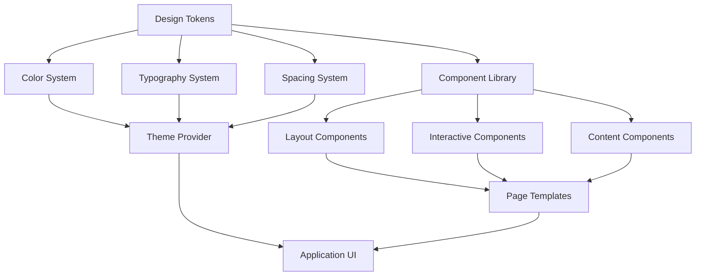

# Design Document: Modern UI Redesign

## Overview

This design document outlines the complete visual transformation of the Amdox Jobs platform from its current "AI created classic blue design" to a modern, eye-catching interface that stands out in the competitive job platform market. The redesign focuses on creating a visually striking yet highly usable experience that attracts and engages users through contemporary design patterns, dynamic color schemes, and smooth interactions.

The design moves away from the traditional blue gradient theme (#667eea to #764ba2) and embraces modern design trends including vibrant color palettes, sophisticated typography, micro-animations, and improved visual hierarchy. The goal is to create an interface that feels fresh, professional, and engaging while maintaining excellent usability for job seekers and employers.

## Architecture

### Design System Architecture

The new UI system follows a modular design architecture built around these core layers:



**Design Token Layer**: Centralized values for colors, typography, spacing, and animation timing that ensure consistency across all components.

**Component Library**: Reusable UI components built with modern styling patterns including glassmorphism effects, subtle shadows, and smooth animations.

**Theme System**: Dynamic theming support allowing for light/dark modes and potential future theme variations.

**Layout System**: Responsive grid and flexbox-based layouts that adapt seamlessly across devices.

### Color System Architecture

The color system is built around a sophisticated palette that replaces the blue gradient theme:

**Primary Palette**: Vibrant purple-to-coral gradient (#8B5CF6 → #F97316)
**Secondary Palette**: Emerald-to-teal gradient (#10B981 → #06B6D4)
**Accent Colors**: Warm pink (#EC4899), Electric blue (#3B82F6)
**Neutral Palette**: Modern grays with subtle warm undertones
**Semantic Colors**: Success (green), warning (amber), error (red), info (blue)

## Components and Interfaces

### Core Component Specifications

#### 1. Navigation System

**Header Navigation**:
- Modern glassmorphism effect with backdrop blur
- Gradient background with subtle transparency
- Floating appearance with rounded corners and shadow
- Smooth scroll-based opacity changes
- Mobile: Collapsible hamburger menu with slide-out animation

**Sidebar Navigation** (Dashboard):
- Card-based navigation items with hover effects
- Icon + text layout with consistent spacing
- Active state with gradient background and subtle glow
- Smooth transitions between sections

#### 2. Job Card Components

**Job Listing Card**:
```
┌─────────────────────────────────────┐
│ [Company Logo]  [Save Icon]         │
│ Job Title                           │
│ Company Name • Location             │
│ ┌─────┐ ┌─────┐ ┌─────┐            │
│ │Tag 1│ │Tag 2│ │Tag 3│            │
│ └─────┘ └─────┘ └─────┘            │
│ Salary Range        Posted: 2d ago  │
│ ─────────────────────────────────── │
│ Brief job description preview...    │
│ [Apply Now]              [View]     │
└─────────────────────────────────────┘
```

**Styling Features**:
- Subtle gradient border on hover
- Smooth shadow elevation on interaction
- Color-coded tags based on job type/category
- Micro-animations for save/unsave actions
- Responsive layout adapting to screen size

#### 3. Form Components

**Modern Input Fields**:
- Floating label animation
- Gradient focus border effect
- Clear visual hierarchy with proper spacing
- Real-time validation with smooth color transitions
- Icon integration for enhanced usability

**Button System**:
- Primary: Gradient background with hover effects
- Secondary: Outlined with gradient border
- Ghost: Transparent with subtle hover background
- Loading states with animated indicators
- Consistent sizing and spacing patterns

#### 4. Dashboard Components

**Statistics Cards**:
- Clean white/dark background with subtle shadows
- Gradient accent borders
- Icon integration with consistent styling
- Hover effects with gentle elevation
- Responsive grid layout

**Activity Feed**:
- Timeline-style layout with connecting lines
- Card-based activity items
- Color-coded activity types
- Smooth loading animations for new items

## Data Models

### Theme Configuration Model

```typescript
interface ThemeConfig {
  colors: {
    primary: GradientColor;
    secondary: GradientColor;
    accent: ColorPalette;
    neutral: ColorPalette;
    semantic: SemanticColors;
  };
  typography: TypographyScale;
  spacing: SpacingScale;
  shadows: ShadowScale;
  animations: AnimationConfig;
}

interface GradientColor {
  from: string;
  to: string;
  direction?: string;
}

interface ColorPalette {
  50: string;
  100: string;
  200: string;
  300: string;
  400: string;
  500: string;
  600: string;
  700: string;
  800: string;
  900: string;
}
```

### Component State Model

```typescript
interface ComponentState {
  variant: 'primary' | 'secondary' | 'ghost';
  size: 'sm' | 'md' | 'lg' | 'xl';
  state: 'default' | 'hover' | 'active' | 'disabled' | 'loading';
  theme: 'light' | 'dark';
}

interface AnimationState {
  duration: number;
  easing: string;
  delay?: number;
  fillMode?: string;
}
```

### Layout Configuration Model

```typescript
interface LayoutConfig {
  breakpoints: {
    sm: number;
    md: number;
    lg: number;
    xl: number;
    '2xl': number;
  };
  container: {
    maxWidth: string;
    padding: SpacingValue;
  };
  grid: {
    columns: number;
    gap: SpacingValue;
  };
}
```

## Correctness Properties

*A property is a characteristic or behavior that should hold true across all valid executions of a system—essentially, a formal statement about what the system should do. Properties serve as the bridge between human-readable specifications and machine-verifiable correctness guarantees.*

### Property 1: Color System Consistency
*For any* UI component in the system, all colors used should be from the defined color palette, and no legacy blue gradient colors (#667eea to #764ba2) should remain in the codebase.
**Validates: Requirements 1.1, 1.2**

### Property 2: Accessibility Contrast Compliance
*For any* text-background color combination in the system, the contrast ratio should meet WCAG AA standards (4.5:1 for normal text, 3:1 for large text).
**Validates: Requirements 1.3, 4.4**

### Property 3: Interactive State Consistency
*For any* interactive element, hover, focus, and active states should have measurably different visual properties from the default state and provide feedback within 100ms.
**Validates: Requirements 1.4, 3.2, 5.4**

### Property 4: Theme Support Completeness
*For any* color value in the system, both light and dark mode variants should be defined, and theme switching should update all components without visual artifacts.
**Validates: Requirements 1.5**

### Property 5: Layout System Adherence
*For any* layout component, spacing values should be multiples of the base spacing unit, and responsive breakpoints should function correctly across all defined screen sizes.
**Validates: Requirements 2.1, 2.3, 9.1**

### Property 6: Visual Hierarchy Consistency
*For any* page or component, primary actions should have higher visual weight than secondary actions, and information hierarchy should follow defined size and color patterns.
**Validates: Requirements 2.2, 2.5**

### Property 7: Component Design Standards
*For any* interactive component, modern styling attributes (border-radius, shadows, gradients) should be applied consistently according to the design system specifications.
**Validates: Requirements 3.1, 6.1, 8.1**

### Property 8: Animation Performance Standards
*For any* animation or transition, the frame rate should maintain 60fps, respect reduced-motion preferences, and use defined timing and easing values.
**Validates: Requirements 5.1, 5.5, 10.2**

### Property 9: Form Validation Responsiveness
*For any* form input, validation feedback should trigger immediately on input change, with clear visual distinction between error, success, and default states.
**Validates: Requirements 3.4, 8.2**

### Property 10: Typography System Consistency
*For any* text element, font families, sizes, line heights, and letter spacing should use only values defined in the typography system.
**Validates: Requirements 4.1, 4.2, 4.3**

### Property 11: Mobile Touch Target Compliance
*For any* interactive element on mobile devices, the touch target should be at least 44px in both dimensions to ensure accessibility.
**Validates: Requirements 9.2, 9.3**

### Property 12: Asset Optimization Standards
*For any* image or visual asset, files should be optimized for web delivery with appropriate compression and responsive variants for different screen densities.
**Validates: Requirements 10.1, 10.5**

### Property 13: Loading State Consistency
*For any* component with loading states, skeleton screens or loading indicators should match the final content layout and provide immediate visual feedback.
**Validates: Requirements 10.3, 10.4**

### Property 14: Navigation Pattern Consistency
*For any* navigation element across different sections, behavior, styling, and interaction patterns should be identical to maintain user expectations.
**Validates: Requirements 7.1, 7.4**

### Property 15: Job Card Information Architecture
*For any* job listing card, required information elements (title, company, location, tags, salary) should be present and follow the defined layout hierarchy.
**Validates: Requirements 6.2, 6.4**

## Error Handling

### Visual Error States

**Component Error Handling**:
- All interactive components must have defined error states with clear visual indicators
- Error messages should use consistent styling with appropriate color coding (semantic red from palette)
- Form validation errors should appear inline with smooth animations
- Network errors should display user-friendly messages with retry options

**Graceful Degradation**:
- If custom fonts fail to load, system fonts should provide acceptable fallbacks
- If CSS animations are disabled, static states should remain visually appealing
- If images fail to load, placeholder graphics should maintain layout integrity
- If JavaScript is disabled, core functionality should remain accessible

**Theme Switching Errors**:
- Theme transitions should never result in unstyled content
- Color palette switching should be atomic (all or nothing)
- Dark/light mode toggles should handle system preference changes gracefully

### Performance Error Mitigation

**Animation Performance**:
- Animations that drop below 30fps should automatically disable or simplify
- Complex animations should use CSS transforms and GPU acceleration
- Animation queues should prevent overlapping transitions that cause jank

**Asset Loading Failures**:
- Critical CSS should be inlined to prevent render-blocking
- Font loading should use font-display: swap for immediate text rendering
- Image loading failures should trigger fallback placeholder systems

## Testing Strategy

### Dual Testing Approach

The testing strategy employs both unit testing and property-based testing to ensure comprehensive coverage of the UI redesign:

**Unit Tests**: Focus on specific examples, edge cases, and integration points
- Component rendering with different prop combinations
- Theme switching functionality
- Form validation edge cases
- Responsive breakpoint behavior at specific screen sizes
- Animation trigger conditions

**Property Tests**: Verify universal properties across all inputs
- Color palette consistency across all components (minimum 100 iterations)
- Accessibility compliance for all color combinations
- Animation performance across different devices and browsers
- Layout integrity across random screen size combinations
- Typography scaling across all defined breakpoints

### Property-Based Testing Configuration

**Testing Library**: React Testing Library with @fast-check/jest for property-based testing
**Minimum Iterations**: 100 per property test to ensure comprehensive coverage
**Test Tagging**: Each property test must reference its design document property

Example test tags:
- **Feature: modern-ui-redesign, Property 1: Color System Consistency**
- **Feature: modern-ui-redesign, Property 8: Animation Performance Standards**

### Testing Categories

**Visual Regression Testing**:
- Screenshot comparison tests for all major components
- Cross-browser compatibility verification
- Theme switching visual validation
- Responsive layout verification

**Accessibility Testing**:
- Automated WCAG compliance checking
- Keyboard navigation testing
- Screen reader compatibility
- Color contrast validation

**Performance Testing**:
- Animation frame rate monitoring
- Asset loading time measurement
- Bundle size optimization verification
- Runtime performance profiling

**Integration Testing**:
- End-to-end user flows with new UI
- Cross-component interaction validation
- Theme persistence across navigation
- Form submission with new styling

### Continuous Integration

**Automated Checks**:
- CSS linting for design system compliance
- Accessibility audit integration
- Performance budget enforcement
- Visual regression detection

**Manual Review Process**:
- Design system adherence review
- Cross-device testing validation
- User experience flow verification
- Brand consistency evaluation